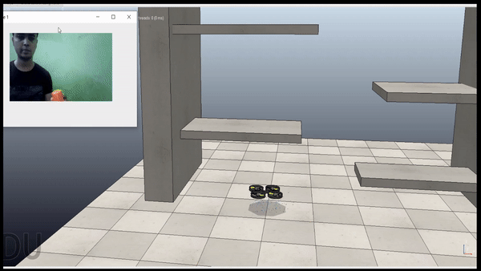

# Drone-control-simulation-by-hand-movement
Simulation is done in V-rep(coppelasim) software with help of Matlab software for image processing

NOTE-

      1.Before starting anything remApi.m ,remoteApiProto.m ,the appropriate remote API library: "remoteApi.dll" (Windows) are on same folder where matlab code is placed
      2.Check connection of V-rep with matlab by opening any of the scene, stating simulation and running simpleTest.m in matlab to check matlab-vrep are connected or not.
      3.Bring a object similar in colour shown in image to control drone or you can use a video provided in this link: https://drive.google.com/file/d/1n-902D8VA1T-FgH_b_nKKT-cd842JwhO/view?usp=sharing 
      

simulation- 

1.Run simulation scene x-z 

2.Download this video needed in this code and place it on same folder  https://drive.google.com/file/d/1n-902D8VA1T-FgH_b_nKKT-cd842JwhO/view?usp=sharing

3.Run in matlab scene xy.m code 
            

simulation- 

1.Run simulation scene x-y 

2.Run in matlab scene xy.m code
